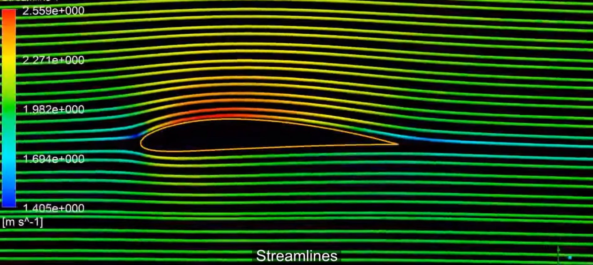
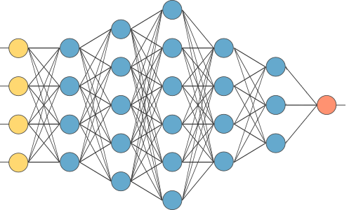
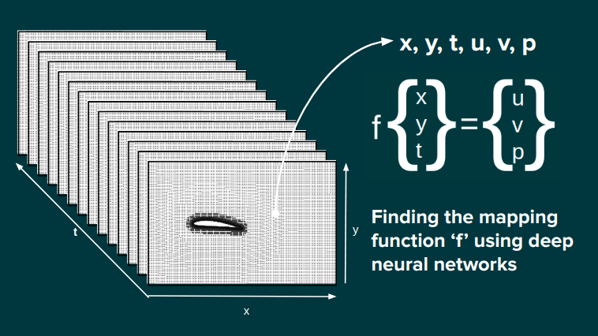
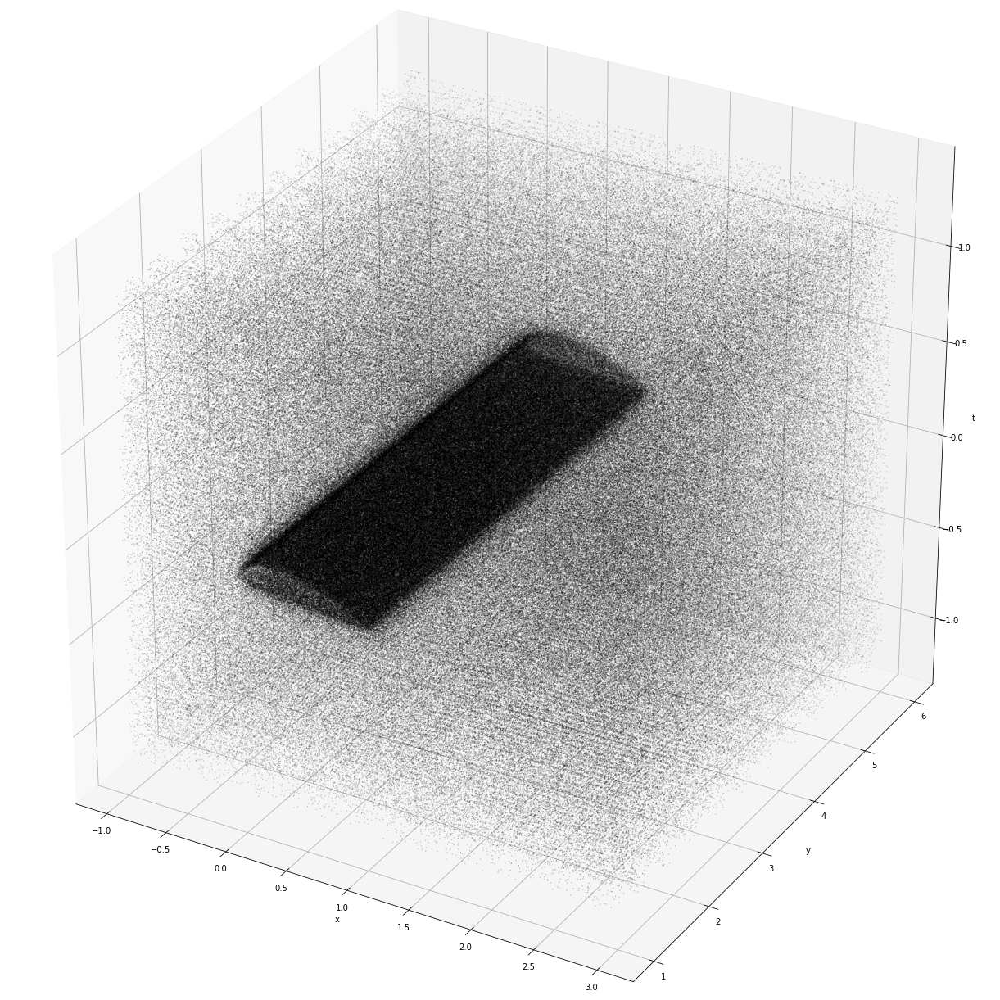
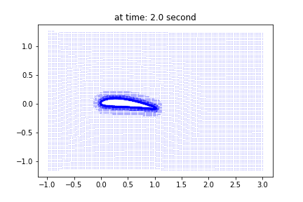
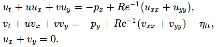
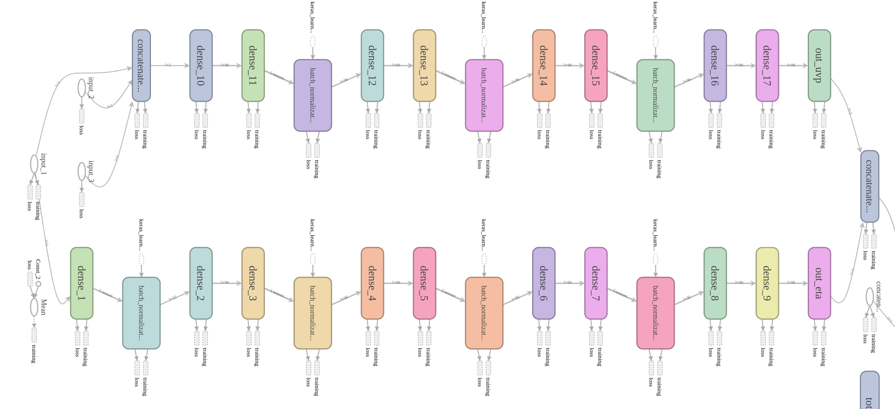
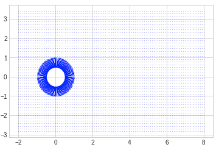
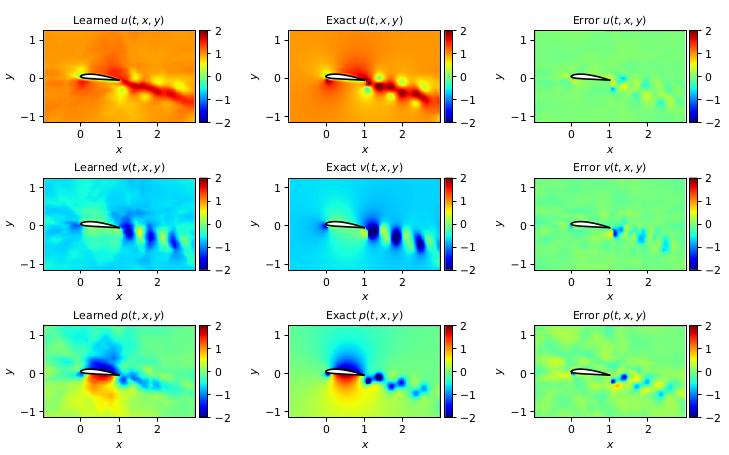
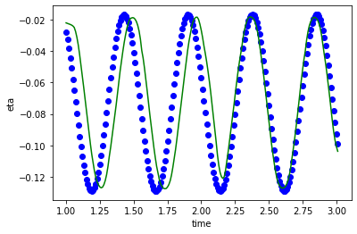

# DeepFoil
### CFD-ML
Combining domains of **Computational Fluid Dynamics** and **Machine Learning**. Our aim is to help the community of chaos modelling and CFD in reducing the need for high-end computations and accurate and bulky data collection during experiments.

    
    

## Methodology

We seek to create continuous fluid flow predictions which align well with corresponding CFD simulations. Our idea is to gather data scattered in space and time and try to learn the transformation function using **deep neural networks**.

This function takes the co-ordinates of any point in space-time co-ordinate system (x, y, t) as inputs and predicts the flow field values (u, v, p) as output of it. An ideal transformation function would be able to stay close to simulation data while satisfying **Navier-Stokes equation**. This imposes another level on the current challenge to derive this function.

Once we have the function, we simply need to pass the all the co-ordinate values of a given time-snap to get the **simulation snapshot at that time step**.

## Video

Shows training, prediction and error evolution with time

[Video 1-3 sec]("Figures/flow.gif")

## Data Plots
As it can be seen, the data collected is neither continuous in co-ordinate scales nor in time steps. The total number of data-points we have are over **9.6 million** spread out evenly between **500 time slices. (0.01sec/slice)**.

### Data transformation
Data transformation had the following steps:
1. **Scraping** useful data from individual simulation files for individual time-steps. Also filtering the domain data from the even larger simulation domain.
2. **Flattening** to 2D and filtering values which are used for model training and evaluation. Force and Torque acting is also preserved for future use.
3. **Performing selectively random data selection** for capturing different percentage of different type of points (explained below). This required finding the exact co-ordinates of surface points at each given instant of time.
4. **Uniform time-selection** of data to uniformly select same number of data points from each time frame.
5. **Shift of reference frame** from experiment reference from to centre of airfoil reference frame. This is required to simplify the complexity of problem where the model has to **deal with sudden absence of fluid** in a region when airfoil is oscillating up and down. In centre-of-mass of airfoil frame, airfoil remains stationary and hence no such sudden absence. We are also rearning the mapping of y-directional oscillation of the airfoil so as to be able to revert back to our original settings after prediction.

### Data selection
The co-ordinate selection is selectively random according to following rule:
1. **Points attached to body** are given highest priority (~70% points from the mesh got selected). This needed to capture boundary layer equation.
2. **Points in the viscinity** of previous layer also face the similar problem and hence are given second highest probability
3. **Any other points** in the chosen domain has a probability of selection ~30%. Domains is 2D and extends from **(-c,-1.2c) to (3c,1.2c)**.

    
    

## Loss function = Mean Squared Error (MSE) + Navier_loss

### Navier loss

## Model Architechture

Branched model consisting of 2 branches. One for flow prediction (u,v,p) and other for displacement of body (eta). Flow prediction is relatively more complex problem and hence requires wider network.

**1. uvp_predictor**
<ul>
    <li>Inputs: x,y,t</li>
    <li>Outputs: u,v,p</li>
    <li>Layer count: 18</li>
    <li>Layer width: 32*3</li>
    <li>Layer type: Dense, BatchNormalization</li>
</ul>

**2. eta_predictor**
<ul>
    <li>Inputs: t</li>
    <li>Outputs: eta</li>
    <li>Layer count: 18</li>
    <li>Layer width: 32</li>
    <li>Layer type: Dense, BatchNormalization</li>
</ul>

### Loss function

Custom Loss: RMSE loss (0.004) + Navier loss (0.0002) 
<strong>Navier Loss</strong>: error in the navier function at any given point. In final model, it gives rise to only 0.2% error.

## Comparison with DeepVIV
DeepVIV (Vortex Induced Vibrations) was the paper which led us to this approach. Their setup was on a much simpler and symmetric problem of flow over an oscillating cylinder while ours uses a more complex asmmetric oscillating airfoil. It would not be suitable to continue with their learning parameters and to compensate for the same, we have changed a few points of focus thereby keeping the general idea and architecture same.

|Property|DeepVIV|DeepFoil|
|-------|-------|--------|
|**Time-Snap of data**|||
|**Boundary condition**|Symmetric|Asymmetric|
|**Total data points**|~ 4 million|~ 9.6 million **(Less data/timestep)**|
|**Number of time frames**|280|500|
|**Inlet Reynold's number**|1000 (diameter based)|1000 (chord based)|
|**Number of oscillations completed**|2 in 14sec|9 in 5sec **(More turbulent)**|
|**Simulation Time**|14 sec|5 sec **(Much faster oscillations)**|
|**Model Architechture**|Deep fully connected sequential neural network|Deep fully connected sequential neural network|
|**Hidden layers**|10 layers|18 layers|
|**Width of model**|Uniform: 32/output|Uniform: 32/output|
|**Final Error**|around 2%|around 6%|

## Results

**Flow at time : 2.3 sec**

**RMSE errors**:

u : 3.23% v : 2.38% p : 1.71%

**Summary:** The model is able to capture flow trend. Most of the error is caused due to mismatch in eta prediction which can be seen in error in v, which has highest dependence on eta. p had the highest error in deepVIV too and so in our case although the methods of obtaining p are different. The reason for this anomaly is to be discussed. The error in direct pressure prediction (our approach) is relatively less.

**How to correct:** Improving eta prediction must be able to address this problem to some extent. Even after that, A bigger model may capture the intricasies to more detail.

**Is it enough:** Yes and No. If our aim is to substitute the current methods, we are far off. But this project had the focus of proving the capabilities of neural network to be able to learn more than that in deepVIV specially when the conditions are asymmetrical.

## Eta study and plot with time

**Summary:** The model is able to capture eta trend but is failing slightly to match due to such high change with respect to time. Most of the error in flow prediction is caused due to wrong eta provided to navier-loss.

**How to correct:** more time frames required. Currently working on the same. Would require even larger model to encompass this doubling of information.

## How to replicate the project:

1. Use [OpenFoam](https://www.openfoam.com/) to do the simulation given in tutorial (pimpleDymFoam/airfoil2D) with minor tweaks.
- flow: laminar
- Re = 1000
- U_0 = 1
- Changes to dynamicMeshDict constraining to move only vertically
- control dict: set simulation time and saving timestep also add function to write lift and drag at each timestep
- convert data format from binary to ascii

2. Run 'Data-Extraction-filtering-transforming pipeline.ipynb' specifying the time duration and region of interest

3. The 'final_tranlated_data.csv' is our training data for 'keras-model-training.ipynb'

4. Use and trained model and final training data for 'keras-model-prediction.ipynb'

5. 'Generate Video.ipynb' stores all photos for all time frames to generate a Video

6. 'Demo.ipynb' gives a demonstration of our learned model.

## Resources:
* Data : [Link](https://drive.google.com/open?id=1YPQifK-q3-ix3bA_yrN8Q9g7SqL8WI1V)
* Model Training (Google Colab): [Link](https://drive.google.com/open?id=1sHQ07g8xqJnf-U2M33xnG369q4max9iv)
* Pre-trained model: [Link](https://drive.google.com/open?id=1-PmJRj7mTwYmUcqkWwphiJpbBYX--zAL)
* Kaggle Kernels: [Kernel 1](https://www.kaggle.com/pervysage101/keras-deepfoil) | [Kernel 2](https://www.kaggle.com/ritvik03/keras-deepfoil)
